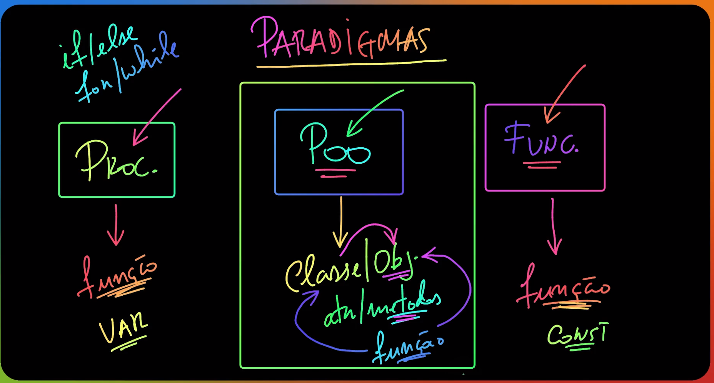

# :books: [Especialista] Iniciando com Typescript

## Introdução

Aula 1

- Tudo que o JavaScript tem, o TypeScript tem também
- Esse curso também vai falar muito de POO

Aula 2

- O node e o browser não interpretam JS nativamente
- `npm init -y` para criar o package.json
- `npx tsc --init` para criar o arquivo de configurações do Typescript
  - Trocar `outDir` para `dist/`, modificando o diretório de saída
- Criar script de _build_ no _package.json_: `"build": "tsc",`
- Criar script de _dev_ no _package.json_: `"dev": "ts-node-dev --respawn src/index.ts",`

Aula 3

- Instalar libs de teste `npm i -D jest ts-jest`
- Criar arquivo de configuração do jest: _jest.config.js_
- Instalar libs de types: `npm i -D @types/jest @types/node`
- Atualizar script _test_ do _package.json:_ `"test": "jest"`
  - Pode rodar com `npm run test` ou simplesmente `npm t`

Aula 4

- TypeScript é JavaScript com “sintaxe para tipos”
  - É um superset fortamente tipado
- POO é muito forte com TypeScript
- Ajuda a escalar projetos grandes pela segurança e visibilidade (com atrelamento ao editor de código)

## Usando tipos

Aula 5

- Falamos sobre os tipos `number`, `string`, `any`, `boolean`
- Também passamos pelo conceito de inferência

Aula 6

- Explicação sobre declaração e uso básico de arrays

Aula 7

- Como criar conjuntos delimitados de valores: enum, constantes e tipo com valores de forma explicita
- Nessa aula, focamos em Enum e usamos o exemplo de dias da semana para exemplificar

Aula 8

- Utilizamos constantes “como enum”, mostrando as vantagens e prejuízos dessa abordagem e cenários em que - talvez - fosse interessante cada uma das formas

Aula 9

- Conhecemos o `type`: também é uma forma de conseguirmos definir um conjunto de elementos delimitados para o valor de uma variável
- Qual das opções iremos usar depende muito da necessidade:
  - Constantes - é não amarrar o tipo (que, no exemplo, continua sendo string), mas tem um conjunto de valores pré-definidos para ajudar e não precisar ficar copiando esses valores em todos arquivos

Aula 10

- Funções e testes
  - Nesse caso, o Léo até comenta que é legal TDD porque evita aquele viés de “não querer encontrar um bug” em um código que você trabalhou por 2 ou 3 dias
  - O problema de TDD é que é mais abstrato (pode ser que tenhamos um pequeno retrabalho)
- Foram exemplos simples sobre funções e testes de tipagem delas

Aula 11

- Vimos formas de usar funções como tipos

Aula 12

- Entendendo como o TS nos ajuda na definição de um objeto

Aula 13

- Desafio para criar um tipo para produto e fazer um método de desconto
  - Poderia criar testes unitários se quisesse

Aula 14

- Resposta do desafio (minha resposta ficou idêntica :) )

Aula 15

- Vimos sobre como unir tipos para permitir mais de um uso para uma variável
  - Também falamos sobre isso ser chamado de “alias” e facilitar a reutilização dos tipos do código, ao invés de repetí-los

Aula 16

- Mostrando que temos a possibilidade de checar os tipos - complementando a aula anterior - uma vez que temos a opção de juntá-los e, em algum momento, podemos querer identificá-los

Aula 17

- Falamos sobre o type `never` que, basicamente, garante que uma função não “termine” ou retorne algo
- Achei bem curioso pois não lembro de ter visto uma implementação dessas já, que fosse obrigatório
  - Mas entendi que preciso ler mais sobre o tratamento de erros, uma vez que esse foi o exemplo usado pelo instrutor do curso

Aula 18

- Abordamos o tipo `null` - e `undefined`, bem brevemente - para ser utilizado em situações onde não temos certeza que encontraremos um valor válido

Aula 19

- Desafio final do capítulo (e minha resposta)

Aula 20

- Resposta do instrutor, com um truque e um “a mais” que ele não tinha passado nos requisitos

## POO

Aula 21

- Paradigmas de programação: definem uma forma de pensar para resolver um problema de programação
- Temos 3 paradigmas essenciais: Procedural; Programação Orientada a Objetos; Funcional

  

- Vamos focar em POO para entender mais sobre classes, objetos, interfaces - que são a base do Typescript

Aula 22

- Foco na POO, propriamente dita
- Mas antes, precisamos estabelecer alguns critérios. Exemplo: a maioria das aplicações dividem-se em Dados x Algoritmos
  - O paradigma que vamos escolher tem absolutamente tudo a ver com a forma como vemos a relação entre essas duas entidades

Aula 23

- Vamos comentar sobre a relação Classe vs Objeto

  

- A classe é usado para definir os atributos e os métodos dos objetos instanciados por ela
  - A classe é o molde, e os objetos são as instâncias

Aula 24

- Passamos pelas palavras reservadas `class`, `new`
- Simplesmente criamos uma classe e colocamos um atributo público diretamente dentro do corpo da classe
  - Atributi público = ele é visível fora da classe (você consegue ler, editar fora do classe)
- Classe sempre é escrita com letra maiúscula

Aula 25

- Modificadores de acesso: são níveis de visibilidade daquilo que pertence a um objeto
- Aprendemos a palavra reservada `private`, para modificar o acesso a um atributo
  - Também falaremos do `protected` mais para frente
- Esses modificadores de acesso, segundo o instrutor, não estão disponíveis no Javascript (mas temos outras formas de fazer)
  - TypeScript é mais explícito
- _“ O maior interessado em garantir que as propriedades de Curso estão corretas, é a própria classe Curso”_

Aula 26

- Primeiro contato com o conceito de `constructor` + `getter`

Aula 27

- Atributo `readonly` para que possamos deixar um atributo “readable”, mas garantindo que ele não será alterado
  - Acaba transformando a propriedade em imutável e não precisamos mais torná-lo `private`

Aula 28

- Aprendemos que podemos declarar todos os atributos da instância diretamente no construtor, pois isso mantém as nossas necessidades e diminui a complexidade da classe

Aula 29

- Desafio: criar uma classe de Produto, com algumas regras de acordo com o atributo e depois calcular o preço com desconto

Aula 30

- Vimos a resposta do desafio e a importância de criar classes consistentes, uma vez que elas irão produzir objetos validados e que não precisam ser testados, em memória, toda vez que são utilizados

Aula 31

- Vamos falar sobre membros de instância (objetos) ou membros de classe (static)
- Membros = são os atributos (dados) e os métodos (comportamentos)

  

- No final, a grande diferença é “a quem” aquele membro pertence:
  - A partir do momento que definimos algo como estático, ele vai passar a pertencer para a classe e todos os objetos instanciados usarão o mesmo valor
  - Do contrário, os membros são apenas moldes que terão valores independentes e serão pertencentes a cada objeto em que forem instanciados

Aula 32

- Abordamos os membros estáticos de uma classe e, para isso, usamos um exemplo de validador
  - Remover todas as validações feitas na classe da aula anterior e movemos ela para uma classe que agrupava validações e, com isso, chamamos todos os métodos diretamente da classe, sem precisar instanciar um novo objeto ou usar o operador `new`
- Obs.: Atributos estáticos - geralmente - são colocados como `readonly`

Aula 33

- Desafio sobre membros estáticos e membros de instância, temos que conseguir printar no console um membro “não estático” dentro de um método estático

Aula 34

- Resposta do desafio: acertei ✅

## Interfaces

Aula 35

- `interfaces` possuem o uso idêntico ao `type`, mas com a diferença de que `type` precisa do `=`
  - Interfaces estão muito relacionadas com o conceito de Herança de POO

Aula 36

- Vimos que para marcar uma propriedade de uma interface como opcional, basta declará-la com o sinal `?`. Exemplo: `pass?: string;`

Aula 37

- Aprendemos a user os utilitários `Partial` e `Required` para tornar as propriedades de uma interface totalmente opcionais ou totalmente obrigatórias, respectivamente
- Para mais detalhes ou outras opções de utilitários, acessar esse link: [https://www.typescriptlang.org/docs/handbook/utility-types.html](https://www.typescriptlang.org/docs/handbook/utility-types.html)

Aula 38

- Aprendemos como criar atributos flexíveis para interfaces, em cenários específicos onde isso pode ser necessário

Aula 39

- Como criar interfaces que definam tipos de funções, diretamente

Aula 40

- Introdução para vermos os 3 pilares da OO, utilizando os mecanismos disponíveis no Typescript pra isso
  - Encapsulamento: _public, private, protected_
  - Herança:
  - Polimorfismo:
  - _Extra -_ Abstração:
- Todos esses princípios possuem inspiração no mundo real, que foram trazidos para o mundo da programação

Aula 41

- Encapsulamento

  - _public_ - nível de visibilidade mais “visível” do sistema, quando é algo é visível para qualquer outro elemento do sistema
  - _protected_ - nível intermediário, quando há uma relação de herança, a classe que herda vai receber os atributos protegidos
  - _private_ - esse é o nível mais restrito, quando um determinado membro está disponível apenas para a classe que é “sua dona”

  

Aula 42

- Exemplo do dia a dia para entendermos um pouco mais o encapsulamento: se vários amigos fossem correr 5km e decidissem correr de mãos dadas, isso tornaria o pace do grupo igual ao pace do corredor mais lento, uma vez que eles estão totalmente ligados - ou, como falamos em código, acoplados
- Essa métrica (acoplamento) nos mostra o quanto um código está vinculado e dependente de outro, e deixa claro que quanto maior for essa métrica, mais dificuldade teremos para manter esse código

  - Nosso objetivo é ter um baixo acoplamento
  - Exemplo de alto grau de acoplamento/dependência:

    

  - Aqui já ficou muito melhor, porque os códigos que deveriam, realmente ficaram “escondidos”:

    

- O mecanismo para “esconder” código dentro do TS usando OO é exatamente esssa ideia de usar os modificadores de acesso (public, protected e private)
  - Além disso, outro mecanismo que tem a ver com encapsulamento é o sistema de módulos do Node: quando definimos um arquivo, estamos definindo um módulo e se não exportamos uma funcionalidade, por exemplo, significa que aquela funcionalidade ficará restrita aquele módulo (privada)

Aula 43

- O instrutor deixou muito claro que precisamos entender/conhecer apenas a interface ou assinatura das coisas para poder usá-las, e não todo seu funcionamento:
  - Exemplo: para usar o carro, nossa interface são o volante, a marcha e os pedais (note que não sabemos nem como o motor funciona)
  - Exemplo2: para usar a TV, nossa interface é o controle remoto (note que não conhecemos sobre led, display, plasma ou oled)
- Os princípios do encapsulamento resumem-se em ter um baixo acoplamento e facilitar o uso por terceiros

  

Aula 44

- O objetivo primordial da Herança é promover reuso, especialmente através de composição (copmpor um objeto complexo por partes)
  - #1 Composição
  - #2 Herança
  - Existe uma regra (não infalível, mas existe, para detectar quando faz sentido usar cada uma delas)
- Abstração = simplificação (pegar apenas o que importa, do mundo real, para o sistema)

Aula 45

- Composição (formas de reuso):
  - _**\_** tem um(a) **\_**_
  - _“Carro tem um motor”_ ✅
  - _“Câmera tem uma lente”_ ✅
- Herança (formas de reuso):
  - _**\_** é um(a) **\_**_
  - _“Carro é um motor”_ ❌
  - _“Civic é um carro”_ ✅
  - _“Ferarri é um carro”_ ✅
  - _“Gato é um animal”_ ✅
- _Toda herança gera uma hierarquia, mas nem toda hierarquia será uma herança_
  - Exemplo: Reino Animal (tem herança, então tem hierarquia) e Exército (tem hierarquia, mas não tem herança)

Aula 46

- Em Typescript, uma classe pode herdar de uma interface
- Uma classe também pode herdar de uma outra classe
- E também podemos ter uma interface dependendo de outra interface
- _Uma classe só pode herdar de uma classe (`extends`); mas uma classe pode depender de muitas interfaces (`implements`); e uma interface pode herdar de muitas interfaces (`extends`)_

  - _`implements` só é usado de classe para interface (iguais usam `extends`)_

  

- Propriedades `privadas` não são transmitidas por herança
- Podemos acessar propriedaes `public` e `protected` da classe que estamos herdando (ex: Carro → Ferrari)

  - Nessa aula, vimos até como “sobrescrever” um desses métodos

  

Aula 47

- Polimorfismo = múltiplas formas
  - Temos os tipos estático e dinâmico e aqui, falaremos especificamente do dinâmico - que tem a ver com herança

Aula 48

- Revisamos o básico das palavras reservadas `public, protected e private` e aplicamos ela em uma classe _Carro_ para exemplificar

Aula 49

- Primeiro exemplo de herança: utilizando interfaces, com herança única e múltipla

Aula 50

- Nesse outro exemplo de herança, misturando classes e interfaces, chegamos em um cenário interessante onde aprendemos dois detalhes novos:
  - Não é possível definir propriedades de uma interface como `protected` ou `private` , por exemplo
  - Por serem públicos, os atributos de uma interface que será implementada em uma classe precisam ser públicos também; se tentarmos definí-los como uma hierarquia mais restrita, o TS apresentará um erro
- Também tivemos um exemplo rápido de polimorfismo

Aula 51

- 💭 Item para estudar: `Generics` do TS
- Mais um exemplo de herança, de classe para interface, usando a abordagem de “caso de uso”

Aula 52

- Fizemos mais um exemplo de herança mas, desta vez, de classe para classe, criando um carro e derivando dois modelos diferentes (fusca e ferrari) com sobrescrita de métodos

Aula 53

- Diferenças entre classes concretas e classes abstratas, comparando um `Celular` com suas implementações `reais/concretas`

  

- Muito legal essa comparação porque cria quase como se fosse uma “timeline” de implementações: de 0% concretas → até 100% concretas
  - E, dentro dessa timeline, vai demonstrando onde cada coisa encontra-se:
    - Uma interface é 0% concreta porque ela apenas define as assinaturas dos membros, ou seja, não implementa nada
    - Já uma classe concreta implementa 100% dos membros concretamente, por isso está no final da linha do tempo
    - E uma classe abstrata pode encontrar-se em qualquer lugar dentro dessa linha, uma vez que ela tem flexibilidade de implementar nenhum, alguns ou todos os membros que possui

Aula 54

- Exemplo simples de polimorfismo com a classe `Animal`
